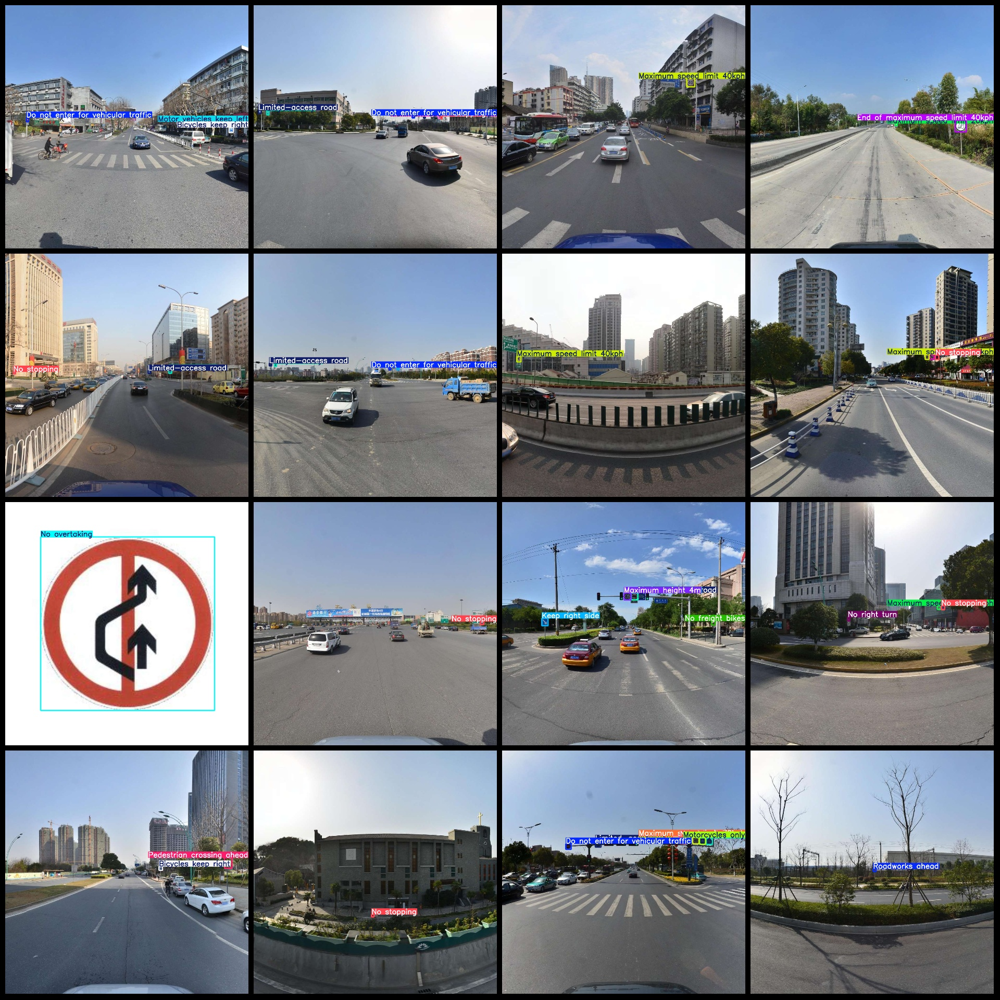
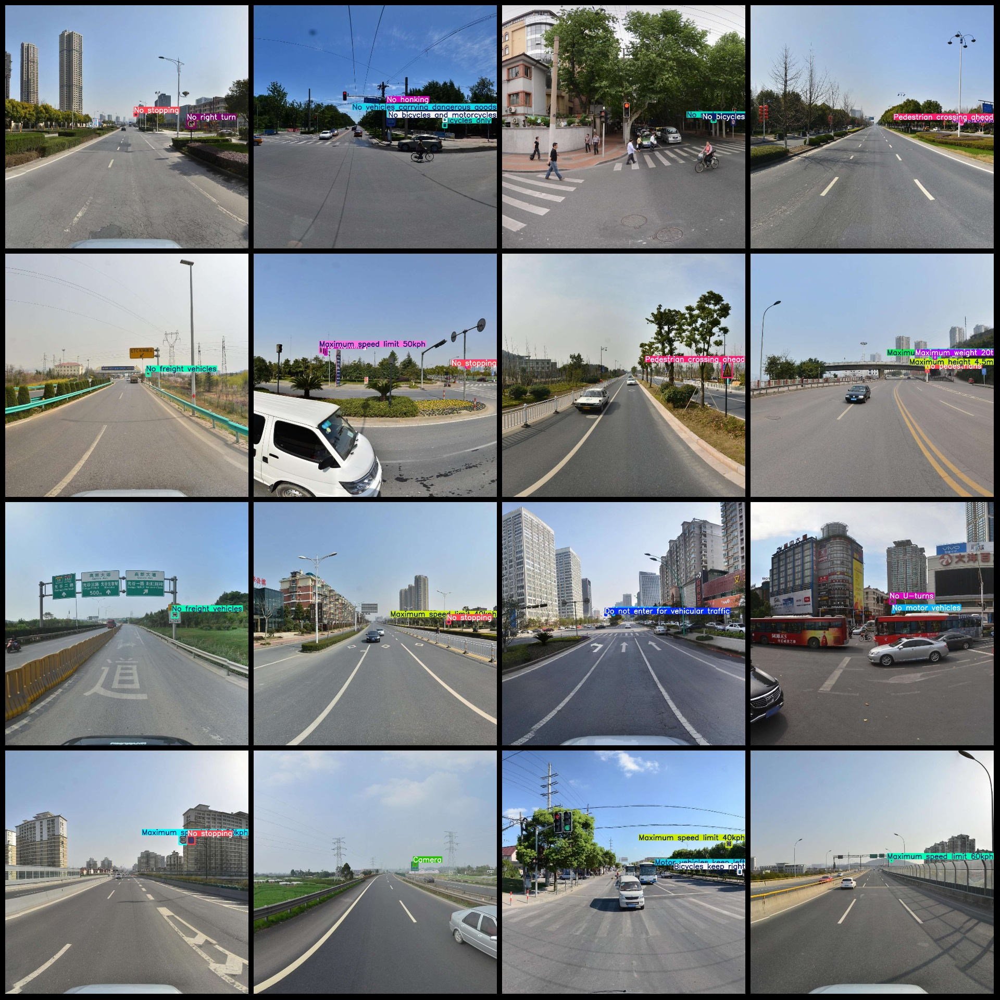

# China Traffic Signs Detection Data Set - VOC+YOLO format with 9129 images and 175 categories

The dataset we are given consists of images of traffic signs, each assigned a number from 1 to 9219, which represents the order in which they appear in the dataset. These images include various types of traffic signs, such as "Accident area" (area prone to accidents), "Be careful" (beware of danger), and so on, totaling 175 categories. Additionally, each category is associated with a list of image numbers, for example, "Accident area" has 6 images corresponding to it.
## Images

Here is a pay link on Stripe ( https://buy.stripe.com/3cs8yP7sY87d0vu9AB ). Please contact me lonlonago@foxmail.com after funding $89, and I will send you a complete data files , thank you!

